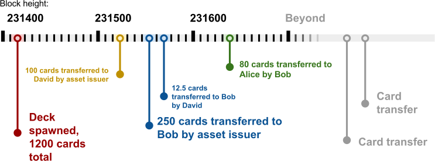

 <h1>PeerAssets</h1> 

<h3>Peer-to-peer Assets</h3>

by: Peerchemist  <peerchemist@protonmail.ch>,  April, 2016.

# Introduction

The idea to use the blockchain to transmit other tokens of value beside the blockchain's native currency first became mainstream in 2013. [1](http://www.coindesk.com/colored-coins-paint-sophisticated-future-for-bitcoin). One of the first proposals of implementation was "EPOBC" [2](https://github.com/chromaway/ngcccbase/wiki/EPOBC_simple) which inspired "Colored Coins" by M. Rosenfeld in 2012. [3](https://bitcoil.co.il/BitcoinX.pdf). Both proposals utilize Bitcoin's OP_RETURN transaction output to encode the metadata and describe the asset. Ever since then, Bitcoin's ecosystem was enriched by different variations of the idea like OpenAssets [4](https://github.com/OpenAssets/open-assets-protocol/blob/master/specification.mediawiki) and CoinSpark [5](https://github.com/coinspark) which are collectively called "Colored Coins", after the original idea. Bitcoin ecosystem offers other ways to transact with assets like Counterparty [6](http://counterparty.io/) and Omni [7](http://www.omnilayer.org/) but they are not considered "Colored Coins" as they use auxiliary currencies. Other crypto-currencies and crypto-platforms have their own implementations which are either variations on the OP_RETURN scheme or differ radically on Bitcoin's implementation and are frequently integrated in the core functionality, like NXT which has taken this concept a long way with integrated asset exchange and dividend payout system [8](https://nxt.org/what-is-nxt/asset-exchange/).

The following paper describes a simple, blockchain agnostic protocol which enables peers to issue and transact with assets. A simple explanation on how PeerAssets protocol works would be that it works by writing and reading messages on the blockchain, where messages represent assets and addresses represent peers. PeerAsset protocol based assets can be utilized to represent any type of asset like bonds or equity. PeerAssets can also represent real life objects, and by doing so confirm their existence on the blockchain. PeerAssets is a *light* protocol, as it utilizes no extra layers over the underlying blockchain. It does not require external value tokens beside the blockchain's native currency, which is used to pay transaction fees. PeerAssets does not participate in organizating or maintaining the public ledger, but takes advantage of its stability and trustworthiness. PeerAssets can work on top of every cryptocurrency that is forked from Bitcoin and has kept a compatible codebase, which includes Peercoin, Litecoin and alike.

PeerAssets does require neither a hard nor soft fork of the host network, but it requires development of a PeerAssets aware client. PeerAssets is also inspired by the original idea of "Colored Coins" and uses OP_RETURN to write data on the blockchain, but offers some optimizations to reduce amount of data written in the OP_RETURN. PeerAssets enables easy querying of the blockchain for relevant transactions and offers some extra features like shareholder voting and dividends payouts.

# Protocol overview

The PeerAssets protocol uses the blockchain to distribute messages and store them permanently. PeerAsset messages are written as metadata attached to transactions, which inseparably tie them to: sending address, transaction ID and block height. Issuing an asset is equal to writing a properly formatted message, then signing it with your unique signature and sticking it on the public bulletin board. After doing that, the entire network will know that you have issued this new asset, which can represent some real object or company stock. The transaction ID of the transaction that posted this message to the blockchain is now considered an asset ID. When you want to send a specific quantity of an asset to another peer, you just write another message stating that you (the issuer) transfer some quantity of the asset to a new owner and sign the message with your unique signature. Now everyone interested can see that you have given up control of said amount of the asset and transferred it to another peer. You can no longer claim that you have the full issued quantity of the asset under your control as everyone who has seen the message would know that you are lying. Instead of sending tokens of value which also represent assets, PeerAssets work by referencing the recieving addresses/peers in the publicly posted messages.
The PeerAssets security model works the same as card counting in casino card games.[9](https://en.wikipedia.org/wiki/Card_counting) If you know the size and type of the card deck and you have those two queens in your hand, you are sure that the other guy is lying if he claims to have three. Each time an asset is created, a new deck (of cards) is spawned and every transaction of a card (asset) is visible to all interested parties, so everyone can keep count of the cards in the deck.

PeerAsset protocol is based on four simple rules:

1. Math is simple, 2+2 will always equal four (card counting).
2. If it is wrong, ignore it (ignore bogus messages).
3. Nature of the blockchain allows proof-of-timeline security model.
4. "First come first served", protocol will always favor older messages.

#### Terminology of PeerAssets

I have found this analogy with a deck of cards the easiest way to describe the protocol, so it is used throughout the paper to explain the internals of the protocol as well as the transaction types.

*Deck spawning* – A transaction which creates a deck.

*Deck* – A declarative message which describes the nature of the asset, and its quantity; contains cards.

*Card* – A quantifiable piece of the deck which effectively behaves like a single asset.

*Card transfer* – A transaction which transfers the ownership of a card to another owner.

*Bogus transfer* - A card transfer that does not have a legit timeline.

## Proof of timeline

*A timeline is a way of displaying a list of events in chronological order.* [10](https://en.wikipedia.org/wiki/Timeline)

Each deck spawning transaction is public, as well as every subsequent card transfer. Following PeerAsset transactions from their source, the deck spawning transaction, to the present describes the timeline of the deck. Each peer on the network follows this timeline independently. Based on the timeline, it registers whether or not there is a card in their possession. When there is a verifiable path from a deck spawning transaction to a card transfer that makes a peer the legit card owner, that is called *proof of timeline*.

*Proof of timeline* is the security and verification model for PeerAsset protocol. It is based on three basic blockchain properties - **immutability**, **linear time passage** and **public visibility** of all data.

The proof of timeline model depends on the fact that the block which contains the PeerAsset transactions is considered valid and is accepted by all network nodes. It is imperative that all peers involved in PeerAsset transactions wait for more than one confirmation so they are sure nothing will corrupt the timeline they are depending on for their asset transfers. A transaction should not be considered confirmed until it is a certain number of blocks deep. [11](https://en.bitcoin.it/wiki/Confirmation)

Figure 1. Timeline of the deck

If we look from block height 231700, from this timeline it can be deducted that:

* Issuer has issued 1200 cards
* David holds 87.5 cards
* Bob holds 182.5 cards
* Alice holds 80 cards
* Issuer is left with 850 cards.

This timeline is verifiable by every peer on the network.

The fourth rule of PeerAssets (first come first served) is elemental to producing a valid timeline. Proof of timeline uses the serialization order of transactions which is: block height, transaction sequence number in block and transaction output sequence number in transaction. This allows clients to always be sure which message is older, even if they are in the same block. In general a client which is assembling a timeline for any specific deck will look for the lower sequence number if two conflicting transactions are in the same block. [12](http://bitcoin.stackexchange.com/questions/2025/what-is-txins-sequence) The serialization order is chosen by the miner, mostly at random, so this is not something that can be exploited by malicious peers.

## Pay-to-tagHash (P2TH)

Pay to tag hash paper proposes a *tagging mechanism, Pay-to-TagHash (P2TH), that allows efficient lookup of application specific transactions based on the addition of transaction outputs to deterministic tagged addresses. P2TH also allows thin clients to find application specific messages using standard functions included in standard client software or via publicly available blockexplorers.* [13](http://peerassets.github.io/P2TH/)

One of the outstanding traits of the PeerAssets protocol is that it utilizes P2TH to mark the relevant transactions, enabling fast and easy querying. This allows unmatched performance and enables very light clients. P2TH is an important piece of the PeerAsset protocol design as it allows for much cleaner client implementations, and reduces the quantity of data that needs to be packed in the OP_RETURN. The P2TH paper was inspired by first draft of PeerAssets paper. In return, the present version of the PeerAssets paper is inspired by the proposals found in the P2TH paper. The original idea of the P2TH paper was to make traversing of the blockchain for PeerAsset transactions more efficient, however it turns out that that is just the start of its possible applications.

PeerAssets uses P2TH for:

* Deterministic tag addresses
* Tagging transactions
* Querying tagged transactions

For more details on how is this done, please read the P2TH paper, which is located in the same Github repository.

_______________________________________________

# How it works

The PeerAssets protocol has four elemental transaction types:

1) Deck spawning transaction

2) Card issue transaction

3) Card burn transaction

4) Card transfer transaction

Please note that when I simplify the protocol by saying "Bob" or "Alice", that it actually means an address. It can also mean that a multisig address in control of several people.

## Deck spawning transaction

*Deck spawning transaction – a transaction which starts deck's timeline and describes the parameters of the deck.*

A Deck is spawned by sending a transaction that includes outputs to:

* P2TH derived address as marker
* OP_RETURN with descriptive metadata

Paying to a tag hash - derived address serves as a marker and permanently marks this transaction as a PeerAssets transaction. The P2TH address is calculated from "PeerAssets/deck spawn" string + salt.
The OP_RETURN transaction carries descriptive metadata like name, url, etc. The transaction ID of such transaction is also considered an asset ID so it is distinguishable from all the other assets on the blockchain.

Example:

 > Bob writes the message that he is issuing an asset and publishes it on the blockchain. To write it on the blockchain, Bob will send a transaction which carries needed data. The message includes the name of the asset and other optional metadata like url of the asset page or forum post. In the following representation, payment to the P2TH derived address is equal to "Hey!". You can think of it as a secret code, one which is understood by all the PeerAsset protocol aware clients to have a specific meaning, in this case that this transaction is about PeerAssets. Deck spawning starts the asset timeline, starting from block height when transaction was included and progressing linearly to the future. Due to nature of the blockchain this message is now permanent and immutable.

> 

Figure 2. Bob declares the asset

This deck is now described by:

* Sender's address (issuing address)
* P2TH tag
* Block height
* Transaction ID
* Metadata in OP_RETURN

Using the transaction ID as deck (asset) ID is important, as all subsequent card transfers of this deck must refer back to spawning transaction via the pay-to-tagHash derived from the asset ID. Please note that the balance of this deck is still zero, as quantity of the cards is still not defined. This was just declaration.

### Multisig deck spawns

As Bitcoin and most of its forks support multi-signature transactions, there is an integrated way to issue an asset which is tied to several privkeys as a multisig deck. A multisig deck would function the same as normal deck, but the deck spawning transaction and card issue transactions would require multiple signing keys. Card consumers should favor multisig decks as it stops a single issuer from diluting the supply of the cards at will.
In the case of a multisig deck spawn, Bob would be a group of people who would sign the deck spawning transaction with several private keys. Using a multisig deck not only increases the credibility, but also the security of a deck.

## Card issue transaction

*Card issue transaction - A transaction which prints out the cards and attaches them to a specific deck*

Bob has declared a "yellow rabbit" deck, but he did not state how many cards that deck will contain. That is declared in a special transaction called a "card issue transaction." This type of transaction is separated from a deck spawning transaction to allow the deck consuming community to regulate the supply of the cards in their deck.
For example, this allows a company which has issued equity via PeerAssets to raise extra funds by issuing and selling new stocks to investors. Naturally, this dilutes the supply of equity, and it is important that shareholders agree to it. No other address but the one that has spawned a deck can issue cards for it, and only the spawning address can have a negative balance of cards. Each transaction originating from the spawning address creates new cards, which means that every output of the issuing address is new card issue.

Card issue transaction pays to:

* Card receiver (new owner)
* P2TH address derived from asset ID
* OP_RETURN stating quantity

Example:

> Bob decides to issue 1000 "yellow rabbit" assets. He sends 1000 "yellow rabbit" tokens from the spawning address to his other address, making him the original owner of the "yellow rabbit" assets. After this event, by reading the timeline of the asset it can be verified that 1) There are 1000 "yellow rabbit" assets, 2) Bob now holds 1000 of those assets, 3) The issuing address now has a balance of -1000 "yellow rabbit" assets.

An issuing address is allowed to have a negative balance, and it serves as a checksum for the entire timeline, as it is possible to verify the final balance against it.

`balance(deck_spawning_addr) = 0 -  sum(balance(all_accounts_on_the_timeline))`

There is no integrated way to stop the deck issuer from just “printing” more cards. This is left to the market and relationship between the deck issuer and the card consumers. The market should react to events like this without any need for external influence. Breaking an economic social contract should result in the asset value spiraling to zero. Due to this, it is recommended to issue a deck using multisig transactions including more than one shareholder.

## Card burn transaction

Cards can be destroyed (burned) by simply assigning the cards back to the issuing address. All inputs to the issuing address are card burns.
The final balance of the issuing address always represents negative balance equal to all the cards in circulation. Equation mentioned above must always be valid:

`balance(deck_spawning_addr) = 0 -  sum(balance(all_accounts_on_the_timeline))`

## Card transferring transaction

*Card transfer – a transaction which transfers the ownership of a card to another owner*

Card transferring transaction pays to:

* P2TH derived from asset ID
* OP_RETURN stating quantity
* Address of the new owner

Example:

> Alice and everyone else on the network can now see that Bob has issued an asset with a specific name, quantity and other metadata. It is verifiable that Bob owns the full quantity of the "yellow rabbit" asset. Alice wants to trade with Bob for a specific quantity of the asset, and Bob agrees to trade so he can send Alice some of his assets. Bob now writes the message, with attached metadata stating the quantity of the asset being transferred, as well as the transaction ID of the asset's deck spawn transaction (asset ID).

> 

Figure 3. Bob transfers a card to Alice

Now each peer on the network can see that Bob has transferred control of 100 "yellow rabbit" cards to Alice.

To be valid, a card transfer must originate from an address which is mentioned in that deck's timeline, meaning that it has some assets assigned to it. The assigned quantity of the asset to such an address has to be larger than the user is trying to spend, otherwise it does not have a valid timeline and is considered *bogus*. Each receiving client will verify the following conditions:

* Does senders address belong to the deck's timeline?
* Does sender have more or equal to quantity of the cards that are included in transaction?
* The incoming quantitiy of cards must be a decimal non-zero number.

As a consequence of this mechanism, losing control of the address that has one's PeerAssets assigned means those assets become immovable and un-spendable, which confirms that the security model of PeerAssets is solid. A card transfer transaction uses the same P2TH mechanism to tag it as a PeerAssets transaction, however it uses the deck spawning transaction ID to reproduce the P2TH address referring to the asset ID. This enables quick and easy verification of the timeline.

## Verifying ownership

*Verifying ownership is verifying if the address is mentioned in the timeline of some deck.*

What if Alice decides to double spend her assets, and how to verify that someone owns an asset?
For example,
> Alice agrees to trade 10 of her "yellow rabbit" assets with David for his 25 "marble" assets, and 10 of those same "yellow rabbit" assets back to Bob for another batch of 30 "marble" assets. In this example, Alice is trying to double spend her 10 "yellow rabbit" assets. How will Bob and David protect themselves from being cheated?
The asset ID of the "marble" asset is publicly known, as it was publicly published by the asset issuer and referenced to Alice at the moment they were sent to her. Alice must check if David really controls 25 "marble" assets, and to do that Alice must know two facts:

> David's address: P9ffxiPYxk3EK4iro83vAszFY2i4XNKVGd

> Asset ID: 548ad20c2081d88bd053520d9b33f2e7b59ebd819dc3a87f68c0d8cd152523fd

What is lacking is the proof that the timeline assigns the asset to David.

The next step is to verify that David owns the given amount of "marble" assets. Alice does this by verifying *proof-of-timeline* for David's address and asset ID. By knowing the transaction ID of this deck's spawning transaction, Alice knows where to start traversing. Alice starts traversing from block height of 223400 until the current block height.

> 

Figure 4. Alice traverses the blockchain

As shown in the illustration, Alice query’s the blockchain for transaction ID: 548ad20c2081d88bd053520d9b33f2e7b59ebd819dc3a87f68c0d8cd152523fd which is the transaction ID of the deck spawning transaction for the "marble" asset. The transaction ID is pointer to block height (223400) when the deck was started, so it is obvious where to start traversing and assembling the timeline. From the timeline spanning from that transaction to the present, Alice can find how many assets were created, who the original owner is, and the balance of the issuing address, as well as who holds the cards now.
By following all PeerAssets transactions marked with the P2TH derived from that asset ID since it's block height, Alice observes the timeline of "marble" asset, and verifies that at the block height of 248057, the issuer of the "marble" deck transferred 30 cards to David. If this block is confirmed by six or more miners, this is considered proof that David does indeed control the assets as promised.

To conclude the trade agreement, Alice transfers her 10 "yellow rabbit" cards over to David, and David transfers his 25 "marble" cards to Alice. Both of the card transfer transactions are now part of each asset's timeline, and are verifiable by anyone.

In the event that "David" is just an alias in control of Bob, Alice does not know that. The PeerAsset protocol does not deal with that. An address is an address. Later on, if Bob wants to group his cards into one address, he will simply transfer them to a single address.

## Doublespending

There is no mechanism to stop peers from sending out bogus PeerAsset transactions or trying to double spend a card (asset). However, thanks to the proof-of-timeline, it is easy for any counterparty on the other side of the bogus card transfer to simply dismiss it as bogus, as explained in PeerAsset rule #2. The only thing that the dishonest peer accomplishes is spending transaction fees.

### Alice tries to double spend

After transferring her "yellow rabbit" cards to David, Alice no longer controls any of the "yellow rabbit" cards. Still, she will try to double spend them by transferring them to Bob again. Alice confirms that Bob holds ownership in the same way she did for David's assets, so she proceeds with the trade. Bob registers the incoming transaction, which is transferring him 10 "yellow rabbit" cards, however Bob does not know if this is a double spend or not. Bob waits for 6 confirmations of that transaction to make sure that the blockchain can not be reversed. After six confirmations, Bob traverses the timeline for the "yellow rabbit" deck to verify that he can claim to own the transferred assets from now on. After the blockchain scan is complete, Bob figures out that Alice did not have those cards in the first place, as she has transferred them to David 18 blocks before trying to send them to Bob.
As there is no legit *proof-of-timeline* that results in Bob owning the cards, Bob dismisses the transfer as bogus and cancels the trade with Alice.

If Alice does these two card transfer transactions in the same block, the valid one is the one that gets included in the block first and the other one is considered bogus.

___________________________________________________________________________________________

# Using PeerAssets to issue equity

While missing out on power features like smart contracts or control over block time interval, PeerAssets might be ideal framework for decentralized companies and organizations that require only basic tools and don't need to dedicate themselves to a fully independent and separate network. If such an organization simply requires the means of tracking ownership, voting and dividend payout, then PeerAssets is the perfect tool for the job.
Organizations and companies using PeerAssets do not need to bother with blockchain security nor network infrastructure. PeerAssets will just work for them. The nature of the PeerAssets allows companies and organizations to be blockchain and cryptocurrency agnostic for the first time. The only dependency of PeerAssets are the transaction fees of the underlying blockchain, but if necessary that can be obfuscated from the end user as well.
Another advantage of PeerAssets is that the protocol can work on top of various blockchains that are based on the original Bitcoin technology, Bitcoin included. This means that PeerAsset decks are movable between blockchains as the issuer pleases, however a legit version of a company's assets can only exist on one blockchain at a time. This ability to move between blockchains makes PeerAssets a much less risky choice, as a company's assets will always be safe in the event that the network that hosts their assets becomes unstable or abandoned by its developers. Organizations utilizing PeerAssets can pick the blockchain that fits them best and move on to another one whenever they choose to. How this is actually done will be described in future addendums of this paper.
PeerAssets is a great fit for issuing company equity as it allows easy and reliable transacting, dividend payments, full control over the supply of stocks by extending the deck or burning the cards and voting proportionally to ownership. In the following text I will propose several ways in which PeerAssets can be used to pay out dividends and allow shareholder voting. A future PeerAssets based company or organization does not have to utilize any, as these are just a showcase and an intro to possible features. However, I do recommend that the rules and scheme of both are communicated to future shareholders before the deck has been spawned by the issuer.

## Paying out dividends

As anyone reading the blockchain can easily verify who holds the assets in any given moment, paying out dividends is very straightforward. Dividend payout starts by identifying which addresses are tied to ownership of an asset, verifying how many assets are tied to them, calculating their stake in the company, multiplying that number with total dividend sum, and sending coins to those shareholders. Some other parameters can be implemented into counting, as per the wish of an asset issuer/dividend payer, for example exempting the last 300 blocks from the count, effectively doing a snapshot of chain from two days ago and eliminating “last minute” changes in asset ownership. This “integrated” feature effectively and simply implements 'ex-dividend'.

## Shareholder voting

Voting can be implemented in a similar manner to the dividend payout. As it is known who has how much of an asset, a snapshot of the blockchain can be taken in any given moment and it can be verified who has how many cards at that time interval. After that, all shareholders would be instructed to send a transaction from the address connected to the asset to a specific “voting” address created by the vote starter. Voting addresses should be proof-of-burn addresses for obvious reasons. If the vote is simple yes or no, both “yes” and “no” can be two unique addresses. With the simple mathematics of counting transactions to “yes” and “no” addresses, and considering each shareholders stake in the deck, it is easy to conclude who has the upper hand in a vote. There is no need for central authority to count the votes, as anyone on the network can verify the results. Also, there is no point in trying to prevent shareholders from casting multiple votes as "protocol will always favor the older message". Only the first vote is counted. Additional votes are simply ignored.

### Voting schemes

More variations of the voting scheme can be implemented, like considering *card age* in the calculation. Card age is a term derived from "coin age" [14](https://github.com/ppcoin/ppcoin/blob/master/src/kernel.cpp) used in Peercoin, and represents a product of the quantity of the tokens and days they have been idle. In the PeerAssets context, card age is a product of the account's card balance and the time which those cards have been immobile at that account (address). This is also easily verifiable from the deck's timeline by anyone on the network. The higher the card age, the more influential the vote is from this shareholder. Naturally, this can be capped to 30 days or any other number. This kind of voting scheme rewards long term holders.

Another variation of voting scheme would be a scheme which rewards frequent voters, "active voting".
Voting is done by sending a transaction to the "voting address". Due to nature of the blockchain, these votes are permanently recorded. That feature enables gathering of statistics on each asset holder and their voting habits. This data would enable the asset community to reward frequent voters by multiplying their voting power with some factor.

Further variations are possible by crossing over card-age scheme and active voting. This is just an example to show what can be done with this toolbox. The reference client will eventually offer these features packed in an easy to use interface.

# Conclusion

PeerAssets offers a framework that enables communities and organizations to issue and transact with assets. In PeerAssets "cards" represent equity in a company, with a set of financial tools at hand like voting and dividend payout. When compared to alternatives like OpenAssets, CoinSpark and others, PeerAssets reduces the amount of data that needs to be written in OP_RETURN, therefore it reduces blockchain bloat. The great advantage of PeerAssets over competing protocols is control over the asset supply and integrated voting and dividend payout system, which many might find extremely useful.

________________________________________________
# References:

[1]( http://www.coindesk.com/colored-coins-paint-sophisticated-future-for-bitcoin): Coindesk, Colored coins in media, 2013

[2](https://github.com/chromaway/ngcccbase/wiki/EPOBC_simple): EPOBC proposal

[3](https://bitcoil.co.il/BitcoinX.pdf): M. Rosenfeld, Overview of Colored Coins, 2012

[4](https://github.com/OpenAssets/open-assets-protocol/blob/master/specification.mediawiki): OpenAssets specification

[5](https://github.com/coinspark): CoinSpark

[6](http://counterparty.io/): Counterparty

[7](http://www.omnilayer.org/): Omni

[8](https://nxt.org/what-is-nxt/asset-exchange/): NXT asset exchange

[9](https://en.wikipedia.org/wiki/Card_counting): Card counting

[10](https://en.wikipedia.org/wiki/Timeline): Wikipedia article - timeline

[11](https://en.bitcoin.it/wiki/Confirmation): Bitcoin wiki - Bitcoin confirmations

[12](http://bitcoin.stackexchange.com/questions/2025/what-is-txins-sequence): Bitcoin stackexchange - what is transaction sequence order

[13](http://peerassets.github.io/P2TH/): Hans Robeers, Pay-to-TagHash (P2TH): Tagging blockchain
transactions for efficient queryabilitity, 2016

[14](https://github.com/ppcoin/ppcoin/blob/master/src/kernel.cpp): Peercoin source code - coin age

_______________________________________

# Further reading:

[1](https://medium.com/peercoin/peerassets-deck-issue-modes-c419f38f7800): PeerAssets Deck Issue Modes
